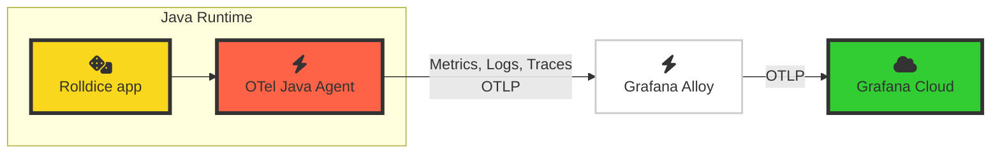

# 1.3. Explore Application Observability

Now let's begin to explore your OpenTelemetry signals in Grafana Cloud.

Remember from the last lab module, your architecture now looks like this:

Now that your application is sending OpenTelemetry signals to Grafana Cloud via Alloy, you can start to see the signals inside your Grafana instance.

## Step 1: Launch Application Observability

1.  Go to your Grafana instance.

1.  In the side menu, navigate to **Application** to open _Application Observability_.

    > Grafana Cloud Application Observability is an out-of-the box solution to monitor applications and minimize MTTR (mean time to resolution). Application Observability natively supports both OpenTelemetry and Prometheus and allows you to bring together application telemetry with data from the frontend and infrastructure layers in Grafana Cloud.

    Application Observability gives you an opinionated view of the OpenTelemetry-instrumented applications in your environment.

    Let's find our application.

1.  In the _Environment_ dropdown, clear any entries (using the *x* button) and add `lab`.

    This will show the list of OpenTelemetry instrumented services which are reporting running in the lab environment.

1.  Find your Service in the service inventory. Remember it will be called something like `rolldice-john` or whatever you configured in the previous module.

    :::tip

    If you don't see your application in the service inventory, wait a few minutes. Applications appear in the service inventory when they have traces.

    :::

    (SCREENSHOT)

    Application Observability instantly shows us the top line stats that we need to know about our service:

    (SCREENSHOT of Duration/Errors/Rate)

1.  Click on the service name to open up the service view.

    (SCREENSHOT)

1.  In this view you can see the most important health metrics from your application.

    - Duration of requests - mean, 95th and 99th percentiles.

    - Error rate

    - Request rate

    :::tip

    For most of the visualizations in the application, Application Observability uses metrics generated from traces (so-called _span metrics_). By default, Application Observability generates these metrics for you.
    
    But this data can come from different places, depending on your preference.

    For example, you can use OpenTelemetry's [Span Metrics Connector](https://github.com/open-telemetry/opentelemetry-collector-contrib/tree/main/connector/spanmetricsconnector) instead, to generate the metrics locally and send them to Grafana Cloud.
    
    For more information, [see the Application Observability docs](https://grafana.com/docs/grafana-cloud/monitor-applications/application-observability/manual/configure).
    :::

1.  Scroll down the page, and you will also find the list of operations

## Step 2: Explore Traces, Logs and Metrics

Traces are one of the building blocks of OpenTelemetry. Traces allow us to observe our system from the inside out.

OpenTelemetry generates traces from our application, which we can explore from Application Observability.

### Traces

1.  Go to the Traces tab.

1.  In the traces list, click on a Trace ID to open the trace view, side-by-side.

    :::tip

    Traces can be complex objects to view. You may find it easier to resize the view by clicking on the separator bar in the center and dragging it to the left.

    :::

1.  In the trace view on the right hand side of the screen, under the heading "Service & Operation", click on the **rolldice** span, then expand:

    - Span Attributes
    - Resource Attributes

    Here we can see the rich set of telemetry data which has been automatically captured by the OpenTelemetry agent.

    View each of these attributes.

    :::info

    Attributes are pieces of metadata that are attached to a trace.

    - Span Attributes: contains metadata relating to this part of the trace. In this example, we only have one span, which captures the HTTP interaction of our app. We can see attributes like `http.route` and `url.query` which help us narrow down to specific requests.

    - Resource Attributes: contains metadata relating to the server which is running our app. In this example, the server is your virtual development environment. We can discover attributes like `process.runtime.name` (Java), `host.name`

    :::

1.  Looking at the span attributes, try to answer the following questions:

    

      
What parameters were sent to our service in the URL query string, if any?

      Look at the **span attribute** `url.query`.
      
      You'll see values like `player=Jane`, `player=Ed`.
    

    

      
Which version and build of Java are we running?

      Look at the **resource attribute** `process.runtime.description`.
      
      It will show something like `Eclipse Adoptium OpenJDK 64-Bit Server VM 17.0.12+7` . (Eclipse Adoptium is a build of the Java Runtime Environment)
    

    

      
Which browser (User-Agent) made the request to the service?

      Look at the **span attribute** `user_agent.original`. 
      
      It should contain something like `k6/0.53.0 (https://k6.io/)`, which is correct, because _k6_ is generating test requests to our service!
    

### Logs

1.  Click on the _Logs_ tab. 

    Notice how Application Observability automatically parses and formats additional context, like the scope name (in Java it's the name of the class), the log level and the trace ID.

    (TODO SCREENSHOT)

    :::note

    Loki performs some mapping on your OpenTelemetry logs:

    - It tries to determine a `service_name` and uses it as a label.
    - It saves some other OpenTelemetry attributes as labels, like:
        - deployment.environment (becomes `deployment_environment`)
        - service.instance.id (becomes `service_instance_id`)
    - It saves some OpenTelemetry attributes as _Structured Metadata_, which are key-value pairs that can be attached to log lines.

    For more information, see [the Loki documentation](https://grafana.com/docs/loki/latest/send-data/otel/).

    :::

1.  From here, expand a log line and then click on the blue button next to `traceID`.

    You will be taken back to the Traces view where you can view that specific trace.

### Metrics and runtime information

As well as capturing Traces and Logs, OpenTelemetry also captures some helpful runtime metrics for our applications.

1.  Click on the "JVM" tab.

    This shows some common metrics relating to Java applications.

    - CPU Utilization

    - Heap memory utilization

    and more.

1.  Finally, click on the Runtime dropdown near the service name.

    You'll see information about the runtime (Java) which has been captured by OpenTelemetry: namely the language.

## Wrapping up

We've covered a lot in this module. We've explored the telemetry available from our application by instrumenting it with the zero-code approach.

Click Next to continue to the final part of this lab, the all-important quiz!

