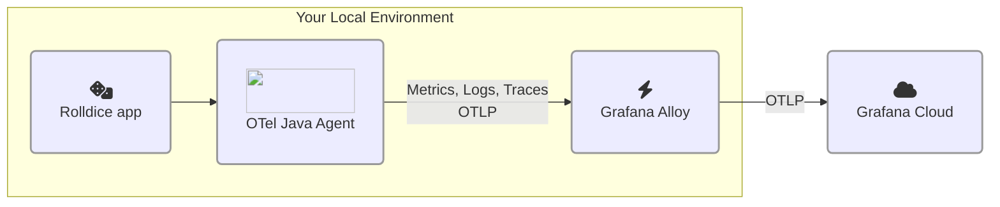

# 1.2. Zero-code OpenTelemetry

In this lab we'll look at how to add zero-code instrumentation to an application.

After you've finished this step, your architecture will look like this:




## What is zero-code instrumentation?

From the OpenTelemetry documentation:

> Zero-code instrumentation adds the OpenTelemetry API and SDK capabilities to your application **typically as an agent or agent-like installation**. The specific mechanisms involved may differ by language, ranging from bytecode manipulation, monkey patching, or eBPF to inject calls to the OpenTelemetry API and SDK into your application.

> Typically, **zero-code instrumentation adds instrumentation for the libraries you’re using.** This means that requests and responses, database calls, message queue calls, and so forth are what are instrumented. Your application’s code, however, is not typically instrumented. To instrument your code, you’ll need to use code-based instrumentation.

:::tip
When you're adding OpenTelemetry to your own applications, you might need to add code-based instrumentation to capture any extra data which isn't automatically captured by the OpenTelemetry SDK for your language.
:::

## Step 1: Create Alloy configuration file

Grafana Alloy is a tool for building observability pipelines, with the full power of OpenTelemetry. We will use it to collect and ship your OpenTelemetry signals to Grafana Cloud.

import Tabs from '@theme/Tabs';
import TabItem from '@theme/TabItem';

<Tabs className="unique-tabs">
  <TabItem value="grafana-cloud" label="Grafana Cloud" default>
    The approach we're using in this lab is to configure Alloy to collect and ship OTLP signals to Grafana Cloud's OTLP endpoint.

    
  </TabItem>
  <TabItem value="banana" label="Grafana Enterprise/OSS">
    In the Grafana Enterprise/LGTM stack, you can configure Alloy to send your OTLP signals to the OTLP endpoints in:

    - Mimir 
    - Loki 
    - Tempo
  </TabItem>
</Tabs>

---

To ship OpenTelemetry directly to Grafana Cloud, you need:

- Your Grafana Cloud <abbr title="OpenTelemetry Protocol">OTLP</abbr> endpoint. It looks something like this: `https://otlp-gateway-<REGION>.grafana.net/otlp`

- A [Grafana Cloud access token](https://grafana.com/docs/grafana-cloud/account-management/authentication-and-permissions/access-policies/authorize-services/) which has the scopes: `metrics:write`, `logs:write`, `traces:write` and optionally `profiles:write`.

Let's get the Alloy configuration that we need:

1.  Go to your Grafana Cloud instance.

1.  From the main menu, navigate to **Integrations**, then click on **Add new integration**.

1.  On the Integrations screen, search for **OTLP**, then click on the **OpenTelemetry (OTLP)** option when it appears.

1.  On the OpenTelemetry (OTLP) integration screen, under the heading "Use an API token", enter a token name (it can be anything you like) and click **Create**.

    A new token will be generated. We will use this token to send telemetry to Grafana Cloud.

1.  Scroll down the page to find some automatically-generated Alloy configuration, and click on the **Copy to clipboard** button.

    <details>
        <summary>See example Alloy configuration</summary>

    ```
    otelcol.receiver.otlp "default" {
        // configures the default grpc endpoint "0.0.0.0:4317"
        grpc { }
        // configures the default http/protobuf endpoint "0.0.0.0:4318"
        http { }

        output {
            metrics = [otelcol.processor.resourcedetection.default.input]
            logs    = [otelcol.processor.resourcedetection.default.input]
            traces  = [otelcol.processor.resourcedetection.default.input]
        }
    }

    otelcol.processor.resourcedetection "default" {
        detectors = ["env", "system"] // add "gcp", "ec2", "ecs", "elastic_beanstalk", "eks", "lambda", "azure", "aks", "consul", "heroku"  if you want to use cloud resource detection

        system {
            hostname_sources = ["os"]
        }

        output {
            metrics = [otelcol.processor.transform.add_resource_attributes_as_metric_attributes.input]
            logs    = [otelcol.processor.batch.default.input]
            traces  = [
                otelcol.processor.batch.default.input,
                otelcol.connector.host_info.default.input,
            ]
        }
    }

    otelcol.connector.host_info "default" {
        host_identifiers = ["host.name"]

        output {
            metrics = [otelcol.processor.batch.default.input]
        }
    }

    otelcol.processor.transform "add_resource_attributes_as_metric_attributes" {
        error_mode = "ignore"

        metric_statements {
            context    = "datapoint"
            statements = [
                "set(attributes[\"deployment.environment\"], resource.attributes[\"deployment.environment\"])",
                "set(attributes[\"service.version\"], resource.attributes[\"service.version\"])",
            ]
        }

        output {
            metrics = [otelcol.processor.batch.default.input]
        }
    }

    otelcol.processor.batch "default" {
        output {
            metrics = [otelcol.exporter.otlphttp.grafana_cloud.input]
            logs    = [otelcol.exporter.otlphttp.grafana_cloud.input]
            traces  = [otelcol.exporter.otlphttp.grafana_cloud.input]
        }
    }

    otelcol.exporter.otlphttp "grafana_cloud" {
        client {
            endpoint = "https://otlp-gateway-prod-us-west-0.grafana.net/otlp"
            auth     = otelcol.auth.basic.grafana_cloud.handler
        }
    }

    otelcol.auth.basic "grafana_cloud" {
        username = "__________"
        password = "glc____________________"
    }  
    ```


    </details>

## Step 2: Configure and run Grafana Alloy

1.  Go to your development environment. From the menu, choose **File**, then **New Text File**.

1.  Paste in the Alloy configuration that you copied above, and then **Save** the file in the folder `project`, and name the file `config.alloy`.

    The path of the file should be `/home/project/config.alloy`.

1.  From the menu bar, choose **Terminal -> Open a new Terminal**. 

1.  In the terminal window, make sure you are in the `/home/project` directory, then run the following command:

    ```
    alloy run config.alloy
    ```

    You should see Alloy start up, and begin to write some logs to the console.

Congratulations! You've just made the first step to collecting and exporting OpenTelemetry signals, by running a collector.

:::tip

For the purposes of this workshop, and to keep things simple, you're running a standalone, foreground instance of Grafana Alloy, inside your development environment.

But in production, there is a range of ways to deploy Alloy. For example, if you're running Kubernetes, you might use Grafana's Kubernetes Monitoring Helm chart, which deploys Alloy to collect OTLP signals **and** also telemetry from your underlying Kubernetes infrastructure.

See [the Alloy documentation](https://grafana.com/docs/grafana-cloud/monitor-applications/application-observability/collector/grafana-alloy-kubernetes/) for more information. 

:::


## Step 3: Configure and run the application

In this step, we'll configure our application to ship OpenTelemetry signals to Grafana Alloy.

Complete the following steps to add zero-code instrumentation to your application, and export signals to Grafana Alloy:

1.  Open your virtual development environment.

1.  From the project explorer pane, open the file `rolldice/run.sh`.

1.  Think of a namespace for your service. Namespace is an attribute that we will use to distinguish your applications from your fellow participants in this workshop.

    You might use something like: `john` or `cthulhu`.

    Remember the name you chose, as we'll use it in the next lab module.

1.  In the file `run.sh`, let's configure the OpenTelemetry Java Agent. **Just before** the final line (`java -jar ...`), insert these lines, replacing `<your name>` with your chosen namespace:

    ```shell
    export NAMESPACE="<your name>" 
    export OTEL_RESOURCE_ATTRIBUTES="service.name=rolldice,deployment.environment=lab,service.namespace=${NAMESPACE},service.version=1.0-demo,service.instance.id=${HOSTNAME}:8080"
    export OTEL_EXPORTER_OTLP_PROTOCOL=grpc
    export OTEL_EXPORTER_OTLP_ENDPOINT="http://localhost:4317"
    ```

    :::warning

    Make sure to replace `<your name>` with the name you chose.

    :::

    What's happening here? We're configuring the OpenTelemetry Java agent to attach the following OpenTelemetry _resource attributes_ to our signals:

    - service.name = `rolldice` - this is the name of our application

    - deployment.environment = `lab` - we're not developing locally, and we're not in a test environment. Does "lab" make sense for the name of our environment?

    - service.instance.id = (your IDE's hostname) - this uniquely identifies your instance, in case there are other instances running

    :::tip

    OpenTelemetry components often use environment variables for configuration. The default value for  `OTEL_EXPORTER_OTLP_ENDPOINT` assumes that you want to send telemetry to an OpenTelemetry collector on `localhost`. We could omit this environment variable entirely, but we're including it explicitly here, to make it clear what's happening. 
    
    In production, you might set this value to `http://alloy.mycompany.com:4317`, or wherever your Alloy instance is located.

    :::

1.  Still in the file `run.sh`, change the final line to attach the [OpenTelemetry Java agent](https://opentelemetry.io/docs/zero-code/java/agent/):

    ```shell
    java -javaagent:opentelemetry-javaagent.jar -jar ./target/rolldice-0.0.1-SNAPSHOT.jar  
    ```

    If you're not familiar with Java, the `-javaagent:` argument tells the Java process to attach an agent at runtime, which can interact with the running program.

1.  Now, start the application again by opening a new terminal (**Terminal -> New Terminal**) and typing:

    ```shell
    cd rolldice

    ./run.sh
    ```

1.  Finally, open another new terminal (**Terminal -> New Terminal**), and generate some traffic to the service by running a k6 load test:

    ```shell
    cd rolldice 

    k6 run loadtest.js
    ```

    The load test will start and run for an hour. Let's leave the script running.

    You can watch the progress of the load test in the console:

    ```
    running (0h26m56.8s), 2/2 VUs, 647 complete and 0 interrupted iterations
    default   [================>---------------------] 2 VUs  0h26m56.8s/1h0m0s
    ```

    :::info

    [k6](https://k6.io/) is a load testing tool from Grafana that makes it super easy to simulate traffic to your services. We've created a k6 script (`loadtest.js`) which tests the service automatically, to save your wrists.

    :::

## Step 4: Smoke test: find a Trace

Now that we've configured zero-code instrumentation on our application, and are collecting signals with Grafana Alloy, let's check that everything is working by running a quick "smoke test". 

Let's find a Trace in Grafana Cloud:

1.  Go to your Grafana Cloud instance.

1.  From the main menu, go to **Explore**.

1.  Select the `grafanacloud-xxxxx-traces` (Tempo) data source.

1.  By **Query type**, click **Search**. Then, add these filters:

    - In the **Service Name** dropdown, select **rolldice**.

    - In the **Tags** section, change **span** to **resource**. Select the **service.namespace** tag, and then the value **(your namespace)**.

    Click **Run query**.

1.  You should see OpenTelemetry traces arriving into Grafana Cloud Traces! Each of the traces shown represents a request being generated by our k6 load test.

At this point, you can explore more into a trace if you like. We will explain this screen and how to observe more signals in the next section of the workshop.

## Wrapping up

In this lab, you've learned how to do the following:

- Quickly grab Alloy configuration and generate a token, to start shipping OpenTelemetry to Grafana Cloud

- Instrument an app without writing a line of code, using the OpenTelemetry agent for Java

- Configure and run Alloy, an OpenTelemetry collector

- Ship OTLP to Grafana Cloud and view some traces

Click Next to continue to the quiz for this lab.
