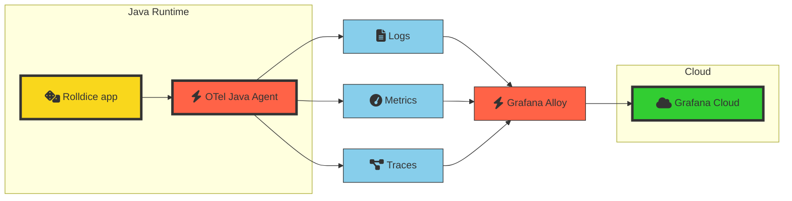

# 1.2. Instrument the application

In this lab we'll look at how to add zero-code instrumentation to an application.

After you've finished this step, your architecture will look like this:




## What is zero-code instrumentation?

From the OpenTelemetry documentation:

> Zero-code instrumentation adds the OpenTelemetry API and SDK capabilities to your application **typically as an agent or agent-like installation**. The specific mechanisms involved may differ by language, ranging from bytecode manipulation, monkey patching, or eBPF to inject calls to the OpenTelemetry API and SDK into your application.

> Typically, **zero-code instrumentation adds instrumentation for the libraries you’re using.** This means that requests and responses, database calls, message queue calls, and so forth are what are instrumented. Your application’s code, however, is not typically instrumented. To instrument your code, you’ll need to use code-based instrumentation.

:::tip
When you're adding OpenTelemetry to your own applications, you might need to add code-based instrumentation to capture any extra data which isn't automatically captured by the OpenTelemetry SDK for your language.
:::

## Step 1: Create Alloy configuration file

Grafana Alloy is a tool for building observability pipelines, with the full power of OpenTelemetry.

To ship OpenTelemetry to Grafana Cloud, you need:

- Your Grafana Cloud OTLP endpoint. It looks something like this: `https://otlp-gateway-<REGION>.grafana.net/otlp`

- A [Grafana Cloud access token](https://grafana.com/docs/grafana-cloud/account-management/authentication-and-permissions/access-policies/authorize-services/) which has the scopes: `metrics:write`, `logs:write`, `traces:write` and optionally `profiles:write`.

Let's get the appropriate configuration file that we need for Alloy:

1.  Go to Grafana Cloud.

1.  Navigate to **Integrations -> Add new integration.**

1.  On the Integrations screen, search for _OTLP_ and click on the _OpenTelemetry (OTLP)_ option.

1.  On the OpenTelemetry (OTLP) integration screen, under the heading "Use an API token", enter a token name and click on Create.

    A new token will be generated. We will use this to send telemetry to Grafana Cloud.

1.  **Copy the Alloy configuration.** Scroll down the page to find some generated Alloy configuration.

    The configuration looks like this:

    ```
    otelcol.receiver.otlp "default" {
        // configures the default grpc endpoint "0.0.0.0:4317"
        grpc { }
        // configures the default http/protobuf endpoint "0.0.0.0:4318"
        http { }

        output {
            metrics = [otelcol.processor.resourcedetection.default.input]
            logs    = [otelcol.processor.resourcedetection.default.input]
            traces  = [otelcol.processor.resourcedetection.default.input]
        }
    }

    otelcol.processor.resourcedetection "default" {
        detectors = ["env", "system"] // add "gcp", "ec2", "ecs", "elastic_beanstalk", "eks", "lambda", "azure", "aks", "consul", "heroku"  if you want to use cloud resource detection

        system {
            hostname_sources = ["os"]
        }

        output {
            metrics = [otelcol.processor.transform.add_resource_attributes_as_metric_attributes.input]
            logs    = [otelcol.processor.batch.default.input]
            traces  = [
                otelcol.processor.batch.default.input,
                otelcol.connector.host_info.default.input,
            ]
        }
    }

    otelcol.connector.host_info "default" {
        host_identifiers = ["host.name"]

        output {
            metrics = [otelcol.processor.batch.default.input]
        }
    }

    otelcol.processor.transform "add_resource_attributes_as_metric_attributes" {
        error_mode = "ignore"

        metric_statements {
            context    = "datapoint"
            statements = [
                "set(attributes[\"deployment.environment\"], resource.attributes[\"deployment.environment\"])",
                "set(attributes[\"service.version\"], resource.attributes[\"service.version\"])",
            ]
        }

        output {
            metrics = [otelcol.processor.batch.default.input]
        }
    }

    otelcol.processor.batch "default" {
        output {
            metrics = [otelcol.exporter.otlphttp.grafana_cloud.input]
            logs    = [otelcol.exporter.otlphttp.grafana_cloud.input]
            traces  = [otelcol.exporter.otlphttp.grafana_cloud.input]
        }
    }

    otelcol.exporter.otlphttp "grafana_cloud" {
        client {
            endpoint = "https://otlp-gateway-prod-us-west-0.grafana.net/otlp"
            auth     = otelcol.auth.basic.grafana_cloud.handler
        }
    }

    otelcol.auth.basic "grafana_cloud" {
        username = "__________"
        password = "glc____________________"
    }  
    ```

## Step 3: Configure and run Alloy

1.  In your development environment, create a new file named `config.alloy`.

1.  Paste in the Alloy configuration that you copied above, and then save the file.

1.  Open a new Terminal, and run the following command:

    ```
    alloy run config.alloy
    ```

    You should see Alloy start up, and write logs to the console.

Congratulations! You've just made the first step to collecting and exporting OpenTelemetry signals.

:::tip

For the purposes of this workshop, and to keep things simple, you're running a standalone instance of Grafana Alloy, inside your development environment.

But in production, you have a range of options available to you, like Grafana's Kubernetes Monitoring Helm chart, which deploys Alloy to collect OTLP signals **and** also telemetry from your underlying Kubernetes nodes.

See [the documentation](https://grafana.com/docs/grafana-cloud/monitor-applications/application-observability/collector/grafana-alloy-kubernetes/) for more information. 

:::


## Step 4: Configure and run the application

In this step, we'll configure our application to ship OpenTelemetry signals to Grafana Alloy.

Complete the following steps to add zero-code instrumentation to your application, and export signals to Grafana Alloy:

1.  Open your virtual development environment.

1.  Open the file `./run.sh`.

1.  Think of a name for your service. Service Name is a key OpenTelemetry attribute and will be used to distinguish yours from the others in the lab.

    Use something like:

    - `rolldice-john`
    - `rolldice-45311`

    Or a name of your choice. The name should not contain any spaces.

    You'll need to remember the name you chose, as we'll use it in the next lab module.

1.  Before the last line, insert these lines:

    ```shell
    export SERVICE_NAME="<your service name>"
    export OTEL_RESOURCE_ATTRIBUTES="service.name=${SERVICE_NAME},deployment.environment=lab,service.version=1.0-demo,service.instance.id=${HOSTNAME}:8080"
    export OTEL_EXPORTER_OTLP_PROTOCOL=grpc
    export OTEL_EXPORTER_OTLP_ENDPOINT="http://localhost:4317"
    ```

    We're setting the following attributes:

    - deployment.environment = `lab` - we're not developing locally, and we're not in a test environment. Does "lab" make sense for the name of our environment?
    - service.name = (your service name)
    - service.instance.id = (your IDE's hostname) - this uniquely identifies your instance, in case there are other instances running

    :::tip

    The default value for `OTEL_EXPORTER_OTLP_ENDPOINT` actually assumes you're running an OpenTelemetry collector on `localhost`. We're just including it here to make it clear what's happening. 
    
    In production, you might set this value to `http://alloy:4317`, or wherever your Alloy instance is hosted.

    :::

1.  _Attach the OpenTelemetry agent on startup._ Change the final line to:

    ```shell
    java -javaagent:opentelemetry-javaagent.jar -jar ./target/rolldice-0.0.1-SNAPSHOT.jar  
    ```

1.  _Start the application_. Now start the application again by running:

    ```shell
    ./run.sh
    ```

1.  _Generate some traffic to the service._ We've created a k6 script to test the service automatically so you can save your hands.

    ```shell
    k6 run script.sh
    ```

    :::info

    [k6](https://k6.io/) is a load testing tool from Grafana that makes it easy to load-test your services.

    :::

Let's leave the script running.

## Wrapping up

In this lab, you did the following:

- Created a token for shipping OTLP to Grafana Cloud

- Quickly instrumented an app using the OpenTelemetry agent for Java

- Configured and run Alloy, an OpenTelemetry collector

- Begun to ship telemetry signals to Grafana Cloud

Click Next to continue to the next lab, as we begin to explore these OpenTelemetry signals in Grafana.

