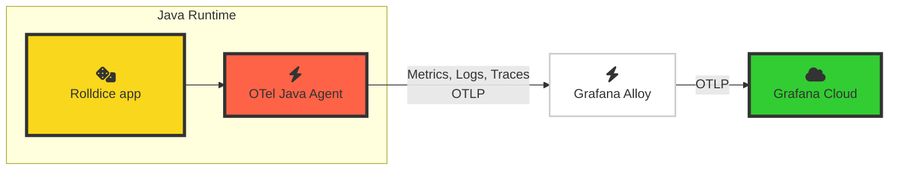

# 2.1. Explore OpenTelemetry in Grafana Cloud

Now let's begin to explore your OpenTelemetry signals in Grafana Cloud.

Remember from the last lab module, your architecture now looks like this:

Now that your application is sending OpenTelemetry signals to Grafana Cloud via Alloy, you can start to see the signals inside your Grafana instance.

## Step 1: Explore Service Overview

**Grafana Cloud Application Observability** is an out-of-the box solution to monitor applications and minimize MTTR (mean time to resolution). Application Observability natively supports both OpenTelemetry and Prometheus and allows you to bring together application telemetry with data from the frontend and infrastructure layers in Grafana Cloud.

Application Observability gives you an opinionated view of the OpenTelemetry-instrumented applications in your environment.

1.  Go to your Grafana instance.

1.  In the side menu, navigate to **Application** to open _Application Observability_.

    :::tip

    If you prefer to use the keyboard, you can press Ctrl+K (or Cmd+K on a Mac) to open the search bar, and type "Application", then hit **Enter**.

    :::

    Application Observability will show us the service inventory - a view showing all of the services currently being monitored with OpenTelemetry Grafana Cloud.

1.  In the **Environment** dropdown, clear any existing entries (using the **X** button) and choose **lab** from the list.

    This will show the list of OpenTelemetry instrumented services which are reporting to be running in the `lab` environment.

1.  Press **+ Filter** to add a filter. Choose **service.namespace** for the attribute name, and in the "value" dropdown, choose your namespace from the list.

    :::info

    If you don't see your namespace in the service inventory, wait a few minutes. Applications appear in the service inventory once span metrics have begun to be generated.

    :::

    :::tip

    We're using the power of OpenTelemetry's _semantic conventions_ here, which help us slice and dice our telemetry so that we can zoom into the exact service instances that we want to view.

    You could use a custom resource attribute to identify your instance of the rolldice application, but `service.namespace` is part of the semantic conventions and seems like a pretty good choice here.

    :::

1.  Now the service inventory will show just your **rolldice** service. Notice how we can instantly see high-level metrics about the service:

    - Duration (P95)
    - Error Rate
    - Request Rate

    Notice how Application Observability also shows the Java coffee-cup logo. This is because the OpenTelemetry instrumentation stores the runtime information in the attribute `telemetry.sdk.language`.

1.  Click on the `rolldice` service to open the Service View.

    Notice how the Service View title is `<namespace name>/<service name>` to show you exactly which namespace we're looking at.

    Application Observability instantly shows us the top line stats that we need to know about our service:

    (SCREENSHOT of Duration/Errors/Rate)

    In this view you can see the most important health metrics from your application.

    - Duration of requests - mean, 95th and 99th percentiles.

    - Error rate

    - Request rate

    :::tip

    For most of the visualizations in the application, Application Observability shows metrics generated from traces (so-called _span metrics_). By default, Application Observability generates these metrics for you.
    
    Or, if you prefer, you can use OpenTelemetry's [Span Metrics Connector](https://github.com/open-telemetry/opentelemetry-collector-contrib/tree/main/connector/spanmetricsconnector) instead, to generate the metrics locally and send them to Grafana Cloud.
    
    For more information, [see the Application Observability docs](https://grafana.com/docs/grafana-cloud/monitor-applications/application-observability/manual/configure).
    :::

1.  Scroll down the page, and you will find the list of operations that are being invoked on this service, along with their typical (P95) duration, error and request rates:

    (SCREENSHOT OF OPERATIONS PANEL)

## Step 2: Explore Traces, Logs and Metrics

Traces are one of the building blocks of OpenTelemetry. Traces allow us to observe our system from the inside out.

OpenTelemetry generates traces from our application, which we can explore from Application Observability.

### Traces

1.  Go to the Traces tab.

1.  In the traces list, click on a Trace ID to open the trace view, side-by-side.

    :::tip

    To make more room for the trace tail, you can resize the view by clicking on the vertical separator bar in the middle and dragging it to the left.

    :::

1.  In the trace view on the right hand side of the screen, under the heading "Service & Operation", click on the **rolldice** span, then expand:

    - Span Attributes
    - Resource Attributes

    Here we can see the rich set of attributes which have been automatically captured by the OpenTelemetry agent.

    :::info[Understanding _span_ and _resource_ attributes]

    Attributes are pieces of metadata that are attached to a trace.

    - **Span Attributes** contain metadata relating to this part of the trace. In this example, we only have one span, which captures the HTTP interaction of our app. We can see attributes like `http.route` and `url.query` which help observe the detail of this specific request.

    - **Resource Attributes** contain metadata relating to the server which is running our app. In this workshop, the server is your virtual development environment. We can discover attributes like `process.runtime.name` (Java), `host.name`, and so on.

    :::

1.  Looking at the span attributes, try to answer the following questions:

    - What parameters were sent to our service in the URL query string?

        

        
Answer

        Look at the **span attribute** `url.query`. It should show a value like `player=John`.
        

    - Which version and build of Java are we running?

      

        
Answer

  
        Look at the **resource attribute** `process.runtime.description`.
        
        It will show something like `Eclipse Adoptium OpenJDK 64-Bit Server VM 17.0.12+7` . (Eclipse Adoptium is a particular build of Java)
      

    - Which browser (User-Agent) made the request to the service?

      

        
Answer

  
        Look at the **span attribute** `user_agent.original`. 
        
        It should contain something like `k6/0.53.0 (https://k6.io/)`, which is because _k6_ is generating test   requests to our service!
      

### Logs

1.  Click on the **Logs** tab. 

1.  On the right-hand side, ensure the **OTLP gateway / native Loki otlp query** button is selected.

    Notice how Application Observability automatically writes a Loki LogQL query to find logs for this service, narrowed down to our namespace.
    
    Application Observability also automatically parses and formats additional context which was sent by the OpenTelemetry instrumentation, such as the **scope name** (which, in Java, holds the name of the class), the log level and the trace ID.

    (TODO SCREENSHOT)

    

      
How does Grafana Cloud process your OpenTelemetry logs?

      Grafana Cloud performs some mapping on your OpenTelemetry logs:
  
      - It tries to determine a `service_name` and uses it as a _Loki label_.
      - It saves some other OpenTelemetry attributes as labels, like:
          - deployment.environment (becomes `deployment_environment`)
          - service.instance.id (becomes `service_instance_id`)
      - It saves some OpenTelemetry attributes as _Structured Metadata_, which are key-value pairs that can be attached to   log lines.
  
      For more information, see [the Loki documentation](https://grafana.com/docs/loki/latest/send-data/otel/).
    

1.  From here, expand a log line by clicking on the **&gt; (chevron)**. Scroll down, then next to _traceID_ click on the **View trace** button.

    You will be taken back to the Traces view where you can view that specific trace.

### Metrics and runtime information

As well as capturing Traces and Logs, OpenTelemetry also captures some helpful runtime metrics for our applications, right out of the box.

These metrics can be really helpful in identifying issues which may not immediately be obvious from traces or logs.

1.  Click on the **JVM** tab. This tab changes dynamically, depending on the language of the service. Here, it shows some metrics which are typical for a Java application:

    - CPU Utilization

    - Heap memory utilization

    and more.

1.  Finally, at the top right of the screen, click on the **Runtime** dropdown near the service name.

    You'll see information about the runtime (Java) which has been captured by OpenTelemetry: namely the language.

## Wrapping up

In this lab, we've covered the following:

- Exploring OpenTelemetry-instrumented Services in Application Observability

- Using resource attributes to narrow down and view signals for a specific service

- Viewing and correlating between traces and logs 

- Viewing runtime metrics from our application

Click Next to continue.

