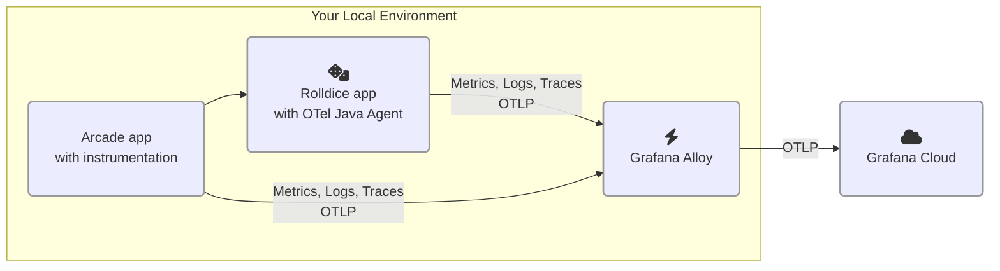

# 2.2. Instrument a second service 

In this lab, you'll add a second service to our application, and add instrumentation to it.

After you complete this module, your environment will look like this:




## Step 1: Instrument a Node.js service 

Sometimes, zero-code instrumentation isn't possible, or doesn't exactly meet your needs. That's where manual instrumentation comes in.

Some languages require you to add OpenTelemetry libraries or code into your application. JavaScript is one example of a language that requires this.

Let's get some hands-on experience with adding instrumentation to a JavaScript application. You'll add instrumentation to a second service called _GamesApp_. This service calls the _Rolldice_ service to get a random roll of the dice.

1.  Open your virtual development environment.

1.  Firstly, stop the k6 test if it is still running: find the terminal running the k6 script, and press **Ctrl+C**.

1.  Open a new terminal (**Terminal -> New Terminal**), run this:

    ```
    cd gameserver

    npm install @opentelemetry/sdk-node \
        @opentelemetry/api \
        @opentelemetry/auto-instrumentations-node \
        @opentelemetry/sdk-metrics \
        @opentelemetry/sdk-trace-node \
        @opentelemetry/exporter-trace-otlp-proto \
        @opentelemetry/exporter-metrics-otlp-proto
    ```

1.  In the main editor window, create a new file `gameserver/instrumentation.js`, and paste in the following contents, then **Save** the file:

    ```js
    /*instrumentation.js*/
    const opentelemetry = require('@opentelemetry/sdk-node');
    const {
        getNodeAutoInstrumentations,
    } = require('@opentelemetry/auto-instrumentations-node');
    const {
        OTLPTraceExporter,
    } = require('@opentelemetry/exporter-trace-otlp-proto');
    const {
        OTLPMetricExporter,
    } = require('@opentelemetry/exporter-metrics-otlp-proto');
    const { PeriodicExportingMetricReader } = require('@opentelemetry/sdk-metrics');
    
    const sdk = new opentelemetry.NodeSDK({
        traceExporter: new OTLPTraceExporter(),
        metricReader: new PeriodicExportingMetricReader({
            exporter: new OTLPMetricExporter(),
        }),
        instrumentations: [getNodeAutoInstrumentations({
            '@opentelemetry/instrumentation-fs': {
                requireParentSpan: true,
            },
        })],
    });
    sdk.start();
    ```

1.  Open the file `gameserver/package.json` and find this line:

    ```
        "start": "node server.js",
    ```

    **Change the line** to this:

    ```
        "start": "node --require ./instrumentation.js server.js",
    ```

1.  Open a new terminal.

1.  In the terminal, change to the `gameserver` directory:

    ```
    cd gameserver
    ```

1.  Set your namespace (keep the same namespace you chose for the previous lab):

    ```
    export NAMESPACE=(your chosen namespace)
    ```

    Then run the app:

    ```
    OTEL_RESOURCE_ATTRIBUTES="service.name=gameserver,service.namespace=${NAMESPACE},deployment.environment=lab" npm run start
    ```

1.  In another terminal, test the service:

    ```
    curl -H 'Content-type: application/json' localhost:3001/play -d '{ "name": "Player1" }'
    ```

1.  Finally, let's generate some load to the service.

    :::tip

    Ensure you have stopped the previous k6 load test before continuing. To stop the load test, find the terminal where k6 is running and press **Ctrl+C**.

    :::

    
    Now, start up the load test for this service:

    ```
    cd gameserver

    k6 run loadtest.js
    ```

## Step 2: Find distributed traces

Now that we've added a second service to our application, we can start to see distributed traces spanning more than one service:

1.  Go to your Grafana Cloud instance.

1.  From the main menu, go to **Explore**.

1.  Pick the **Tempo** (`grafanacloud-xxxx-traces`) data source.

1.  By **Query type**, click **TraceQL**. This time, instead of using the drop-downs, we'll write TraceQL, which is a succinct language for finding traces in Tempo or Grafana Cloud Traces.

    Paste this TraceQL query in the box, replacing `<NAMESPACE>` with your chosen namespace:

    ```
    {resource.service.namespace="<NAMESPACE>" && resource.service.name="gameserver"}
    ```

1.  Find a trace and **click on the trace ID** to open the Trace view. Now we're beginning to see some interesting traces!

    - Notice how the trace also includes the request to the _rolldice_ service.

    - OpenTelemetry is silently adding _Context propagation_ headers to our messages, so we can correlate these two interactions into a single trace.

    Explore further in the trace. Can you find out:

    - How long did the request to the "rolldice" service take?

1.  Finally, go to Application Observability (from the menu , click **Application**).

1.  Using the filters, narrow down the service inventory to:

    - environment = lab

    - service.namespace = (your name)

1.  Click on the Service Map.

    You'll now see a visualization of all services and their interactions. You can see the number of requests per second to the service.

1.  Go to the _gameserver_ service.

    - See how "rolldice" is now added as a "Downstream" service

    - Check out "Operations" panel, which shows all the individual API operations that we're calling.

## Step 3: Investigate an error captured by OpenTelemetry

Finally, let's check the health of our service. 

OpenTelemetry instrumentation is able to mark traces with a status of **error** when it detects that an error has happened in an instrumented service. That makes it a lot easier to identify failed requests to our services, and in Grafana we can easily drill down to find out the root cause.

1.  In Application Observability, check out the Errors panel for the _gameserver_ service.

    Notice how we seem to have some errors.

    (SCREENSHOT OF ERRORS IN SERVICE ERROR PANEL)

1.  Let's check out the errors. In the the top right of the Errors panel, click on the **Traces** button. This shows all of the traces for the given time period which have a status of `error`.

1.  **Click on a trace**. Can you figure out why there's an error? Expand the spans within the trace to learn more.

    Remember what you discover - you can check your hypothesis with the quiz at the end of this lab.

## Wrapping up

In this module we saw:

- How to add instrumentation to a service which requires adding some code 

- How traces between services are correlated into the Application Observability view 

- How the Service Map grows as additional services are instrumented 

Most importantly, we did not have to add extra support to our agent or collector. Alloy received OTLP signals from our application, and forwarded them automatically to Grafana Cloud.

Click Next to continue.

