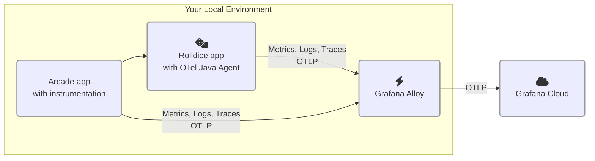

# 2.2. Instrument a second service 

In this lab, you'll add instrumentation to a second service.

After you complete this module, your environment will look like this:



Sometimes, zero-code instrumentation isn't possible, or doesn't exactly meet your needs. That's where manual instrumentation comes in.

## Step 1: Instrument a Node.js service 

Let's add instrumentation to a second service _GamesApp_. This service calls the _Rolldice_ service to get a random roll of the dice.

1.  Create a new file `gameserver/instrumentation.js`.

    Paste in the following contents:

    TODO: Remove "fs" instrumentation

    ```js
    /*instrumentation.js*/
    const opentelemetry = require('@opentelemetry/sdk-node');
    const {
        getNodeAutoInstrumentations,
    } = require('@opentelemetry/auto-instrumentations-node');
    const {
        OTLPTraceExporter,
    } = require('@opentelemetry/exporter-trace-otlp-proto');
    const {
        OTLPMetricExporter,
    } = require('@opentelemetry/exporter-metrics-otlp-proto');
    const { PeriodicExportingMetricReader } = require('@opentelemetry/    sdk-metrics');
    
    const sdk = new opentelemetry.NodeSDK({
        traceExporter: new OTLPTraceExporter(),
        metricReader: new PeriodicExportingMetricReader({
            exporter: new OTLPMetricExporter(),
        }),
        instrumentations: [getNodeAutoInstrumentations({
            '@opentelemetry/instrumentation-fs': {
                requireParentSpan: true,
            },
        })],
    });
    sdk.start();
    ```

1.  Edit the file `package.json` and change the `start` line to this:

    ```
    node --require ./instrumentation.js server.js
    ```

1.  In a terminal, run this:

    ```
    npm install @opentelemetry/sdk-node \
        @opentelemetry/api \
        @opentelemetry/auto-instrumentations-node \
        @opentelemetry/sdk-metrics \
        @opentelemetry/sdk-trace-node \
        @opentelemetry/exporter-trace-otlp-proto \
        @opentelemetry/exporter-metrics-otlp-proto
    ```

1.  Open a new terminal.

1.  In the terminal, change to the `gameserver` directory:

    ```
    cd gameserver
    ```

1.  Run the app:

    ```
    export NAMESPACE=yourname
    PORT=3001 OTEL_RESOURCE_ATTRIBUTES="service.name=gameserver,service.namespace=${NAMESPACE},deployment.environment=lab" npm run start
    ```

1.  In another terminal, test the service:

    ```
    curl -H 'Content-type: application/json' localhost:3001/play -d '{ "name": "Player1" }'
    ```

1.  Finally, let's generate some load to the service. First, stop your other load test (if it's still running).

    To stop the load test, find the other terminal and hit Ctrl+C.

    Now, start up the load test for this service:

    ```
    cd gameserver
    k6 run script.js
    ```

## Step 2: Find distributed traces

1.  In Grafana, go to Explore.

1.  Pick the Tempo (traces) data source.

1.  Search for Traces:

    - Service name: _gameserver_
    
    Then click Search.

1.  Find a trace and click on it to open the Trace view.

    - Notice how the trace is also tracing _rolldice_.

    - OpenTelemetry is silently adding **Context propagation** headers to our messages, so we can connect these two services together.

    Explore further in the trace. Can you find out:

    - How long did the request to the "rolldice" service take?

1.  Finally, go to Application Observability (side menu -> Application).

1.  Using the filters, narrow down the service inventory to:

    - environment=lab
    - service.namespace=(your name)

1.  Click on the Service Map.

    You'll now see a visualization of all services and their interactions. You can see the number of requests per second to the service.

1.  Go to the _gameserver_ service.

    - See how "rolldice" is now added as a "Downstream" service

    - Check out "Operations" panel, which shows all the individual API operations that we're calling.

## Step 3: Investigate an error

Finally, let's check the health of our service.

1.  In Application Observabliity, check out the Errors panel for the _gameserver_ service.

    Notice how we seem to have some errors.

    (SCREENSHOT)

1.  Let's check out the errors. Click on the _Traces_ button in the Errors panel. This loads all of the traces which have a status of `error`.

1.  Expand a trace. Can you figure out why there's an error?

    Expand the spans within the trace to learn more.

    Remember what you discover - you can test yourself in the quiz at the end.

## Wrapping up

In this module we saw:

- How to add instrumentation to a service which requires adding some code 

- How traces between services are correlated into the Application Observability view 

- How the Service Map grows as additional services are instrumented 

Most importantly, we did not have to add extra support to our agent or collector. Alloy received OTLP signals from our application, and forwarded them automatically to Grafana Cloud.

Click Next to continue.

